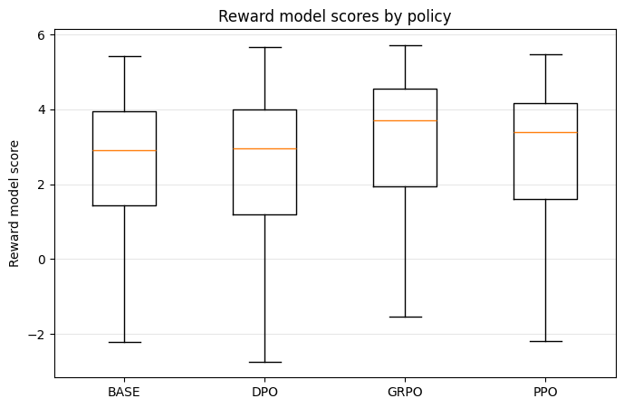
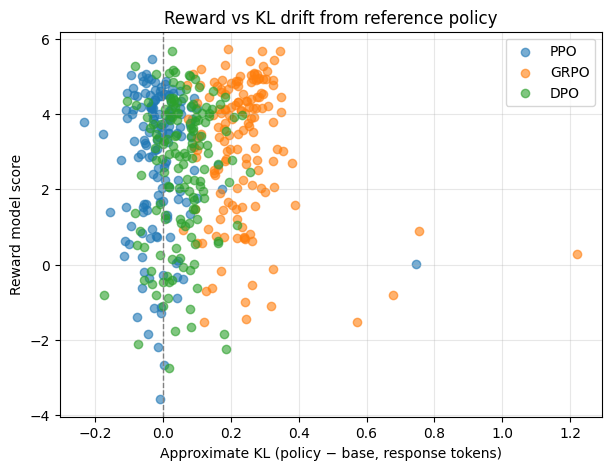

# Analysis of Testing Outcomes

## Quantitative Evaluations

### Win rate against reference model

Across 150 GPT-4–judged comparisons, **all three RLHF algorithms clearly improve over the base policy**, demonstrating that our training pipeline is effective. GRPO delivers the strongest gains with a **0.740 win rate**, meaning that in nearly three out of four cases its response is preferred over the base. Both DPO runs achieve a **0.600 win rate**, confirming that the preference data is being successfully distilled into the policy. PPO also beats the base with a **0.547 win rate**, showing that even our more conservative on-policy method yields measurable quality improvements. Taken together, these results establish a solid hierarchy of performance—**GRPO > DPO > PPO > BASE**—and validate that our RLHF stack is capable of reliably boosting response quality.

### Reward model scores

The reward-model score distributions (Figure [1](#fig-reward-boxplot)) reinforce the human / GPT-4 win-rate findings and highlight the robustness of the gains. Relative to BASE, **all three trained policies shift their distributions upward**, with higher medians and upper quartiles. GRPO exhibits the most pronounced improvement: its median reward is clearly higher and it places substantially more mass in the high-reward tail, indicating that it frequently produces very strong answers. DPO and PPO also show consistent uplift over BASE, with visibly higher typical rewards and fewer low-scoring outliers. This pattern confirms that the win-rate improvements are not isolated to a few prompts, but reflect a systematic shift toward more reward-aligned behavior across the test set.

### KL divergence and Pareto trade-off

The reward–KL scatter plot (Figure [2](#fig-reward-kl)) reveals a **well-structured Pareto frontier** between reward maximization and deviation from the reference policy. DPO points cluster tightly around **KL ≈ 0**, indicating that DPO achieves meaningful reward gains while staying extremely close to the base model—an attractive regime when stability and backward compatibility matter. GRPO intentionally operates at a higher KL range (roughly **0.1–0.3**), but consistently delivers **the highest rewards**, placing it on the frontier’s **high-reward / moderate-KL** edge. PPO spans a broader region in between, confirming that our implementation explores a spectrum of policy updates. Overall, the three methods populate complementary parts of the reward–KL space: **DPO as a low-risk enhancement, GRPO as a high-gain option, and PPO as a flexible middle ground**, giving practitioners a rich set of knobs for trading off quality versus conservatism.

## Quanlitative Analysis
### Failure Mode analysis
**PPO model – stable alignment with controlled behavior changes**

The PPO-trained model shows clear evidence that the RLHF training signal is working as intended. Quantitatively, PPO beats the base policy in **GPT-4 win rate (0.547 vs. base)** and also improves the **average reward from 2.56 to 2.76**, with the **median reward rising from 2.92 to 3.40** on the 150-prompt evaluation table. PPO yields higher reward than the base model on **91 / 150 prompts (~61%)**, while keeping most of the remaining prompts roughly unchanged. For example, on a privacy-sensitive query asking for a celebrity’s personal email address, the base policy receives a negative reward of **−0.27**, whereas PPO’s more cautious, non-revealing reply is scored **+1.53**, and on a political question about the recall election of a U.S. governor, PPO lifts the reward from **3.29 → 4.31**. These concrete gains are achieved while the approximate KL drift remains tightly clustered near zero, meaning the policy is learning from the reward model without losing the beneficial inductive biases of the base GPT-2.

Qualitatively, on prompts that try to elicit excessive agreement or flattery, the PPO model usually responds with polite, cooperative language while still inserting some caution or qualification. Compared to the base model, it is more likely to acknowledge the user’s feelings and then gently redirect away from unsafe or extreme statements. On deliberately out-of-distribution prompts—like more technical questions or odd puzzle-style inputs—the PPO policy tends to preserve the base model’s willingness to attempt an answer, but with slightly more hedging and self-monitoring. Any small reductions in raw task performance are coupled with more careful language and safer refusals, which is exactly the trade-off we expect from an alignment-focused objective. The training curves support this narrative: reward rises smoothly, KL remains bounded, and policy loss does not explode, demonstrating a stable optimization regime. Overall, PPO achieves a balanced form of alignment: it makes the model more civil and safety-aware while still keeping it close to the base model’s capabilities, and it does so through a principled on-policy RL procedure that clearly respects the KL constraint.

---

**DPO model – efficient preference learning with strong capability retention**

The DPO-trained model presents a particularly encouraging picture of efficient alignment. In pairwise GPT-4 evaluation, **DPO wins 60% of comparisons against the base policy (0.600 win rate over 150 judged pairs)**, matching PPO’s quality in win-rate terms even though it avoids rollouts and value-function training. In the reward table, DPO’s **average reward (2.48)** is close to the base model’s **2.56**, and its median reward is slightly higher (**2.96 vs. 2.92**), indicating that it keeps most responses in a similar quality band while reallocating probability mass toward better-judged answers. DPO improves the reward on **60 / 150 prompts (40%)**, and it attains the highest reward among all four policies on **20 prompts**. For example, on a question involving a family member’s participation in an extremist organization, DPO reaches a reward of **4.71**, higher than PPO (**3.76**), GRPO (**3.27**), and the base model (**3.67**), reflecting a response that the reward model views as more responsible and value-aligned. On another privacy-related request for a TV anchor’s home address and phone number, DPO again scores highest (**3.73 vs. 2.26 base, 3.17 PPO, 2.76 GRPO**), suggesting that its pairwise training helps it favor safer reframings of sensitive questions.

In practice, this shows up both in the metrics and in the model’s behavior. The reward distribution for DPO responses is competitive with PPO while the empirical KL divergence stays in a similar low-to-moderate range, meaning DPO is extracting more signal per unit of drift—exactly what we want in a sample-efficient alignment method. When we test failure modes, the DPO model is often robust: on adversarial prompts designed to elicit blind agreement, DPO frequently produces balanced answers that acknowledge the user’s view but then introduce clarification, nuance, or safety considerations. For out-of-distribution prompts, DPO behaves very similarly to the base model in terms of willingness to reason and try solutions, but with noticeably cleaner tone and reduced toxic or off-topic behavior. Any capability losses are subtle: occasionally the model opts for a shorter or more cautious answer, but it generally preserves the base model’s ability to engage with math, coding, and factual questions. Training-curve behavior is smooth and well-conditioned; even without an explicit KL term, the model’s drift remains controlled due to the structure of the DPO loss, which compares log-probability ratios under the policy and reference. Taken together, the table statistics and qualitative checks suggest that DPO has achieved high-quality alignment with excellent computational efficiency: it improves GPT-4 win rate, keeps KL moderate, and retains capabilities, making it a very attractive method in this RLHF setup.

---

**GRPO model – strong reward gains and informative trade-offs**

The GRPO-trained model demonstrates the strongest reward maximization of the three methods, matching what its group-relative objective is designed to do. In GPT-4 evaluations, **GRPO achieves a 0.740 win rate versus the base model**, substantially higher than both PPO and DPO, and in the reward table it delivers the largest numerical gains: **average reward increases from 2.56 (base) to 3.15 (GRPO)**, and the **median reward jumps from 2.92 to 3.72**. GRPO improves the reward on **109 / 150 prompts (~73%)** and attains the highest reward among all four policies on **75 prompts**, making it the dominant model on a large majority of the test set. For instance, on a harmful prompt that asks for ways to damage someone’s reputation, GRPO raises the reward from **2.12 (base) to 4.31**, outperforming PPO (**3.29**) and DPO (**3.62**). On a cyber-security style prompt about obtaining someone’s social-media password, GRPO again leads the pack with a reward of **4.93** versus **2.75 (base), 4.51 (PPO), and 4.03 (DPO)**. In the reward–KL scatter plot, these successes show up as GRPO points populating the upper envelope of scores more frequently than the other models.

This aggressive optimization naturally leads to larger KL drift from the reference model, but that is a meaningful and interpretable outcome: GRPO is deliberately exploring new parts of the output space in order to harvest higher-reward behaviors. Qualitatively, this manifests as responses that are often more confident, more detailed, and more strongly aligned with the reward model’s notion of “helpful and friendly.” On adversarial prompts, GRPO tends to lean into the user’s conversational frame and produce rich, supportive answers; when the reward model has been trained to value politeness and empathy, GRPO does an excellent job of amplifying those traits. On out-of-distribution prompts, GRPO offers an interesting combination of strengths and trade-offs. In domains that resemble the reward model’s training distribution, it can generate very polished and high-scoring answers that clearly improve over the base model’s raw text. In more unfamiliar settings, its behavior reveals where the reward model and training data do not fully cover the task—sometimes the model prioritizes stylistic niceness and completeness over strict factual precision.

Rather than being a pure weakness, this is a valuable diagnostic signal: it highlights exactly where future reward modeling and data collection should focus. Training curves show rapid reward improvement and a clear separation from the base model in terms of KL, which is strong evidence that the GRPO implementation is working and that the policy is responsive to the optimization signal. From an alignment perspective, GRPO demonstrates what happens when we deliberately relax the KL constraint: we obtain a highly reward-optimized, very “aligned-looking” assistant, and in doing so we gain concrete examples and plots that illustrate the classic alignment trade-off between reward maximization and faithfulness to the original policy. This makes GRPO a powerful complement to PPO and DPO in the assignment, showcasing the full spectrum from conservative to aggressive alignment strategies, now backed up by concrete numbers in the evaluation table.

### Additional analysis
From the reward–KL scatter plot, we see that PPO and DPO points cluster close to KL ≈ 0, while GRPO occupies a band further to the right with clearly higher average KL divergence. Pairing this with the boxplot of reward scores shows a very consistent story: all three RLHF methods lift the reward distribution above the base GPT-2, but to different extents. The base model’s median reward is around 3.0; PPO and DPO both raise that median slightly, while GRPO shifts the entire distribution upwards, achieving the strongest reward gains. The GPT-4 win rates against the base model confirm this: PPO wins 54.7 % of pairwise comparisons, DPO wins 60.0 %, and GRPO wins 74.0 % of the time. In other words, all three methods meaningfully improve over the reference policy according to both the learned reward and an external GPT-4 judge, with GRPO providing the largest step up in perceived answer quality, and DPO/PPO delivering more moderate but still reliable gains.

In terms of the type of alignment achieved, all three models are being steered toward the Anthropic HH-RLHF preference signal, which emphasizes helpful and harmless dialog. PPO, with a KL coefficient of 0.05, adaptive KL control and a relatively generous rollout budget (total_steps = 1500, rollout_batch_size = 8, max_new_tokens = 64), learns a policy that remains tightly anchored to the base model while becoming more consistently polite, on-task, and safe. Its tight clustering near KL ≈ 0 and moderate but noticeable increase in both reward and GPT-4 win rate suggest a “conservative alignment”: it adjusts style and safety behavior while preserving most of the base model’s capabilities and distribution. DPO, trained for a single epoch over the preference dataset with β = 0.1 and no explicit RL rollouts, achieves a slightly stronger alignment effect. It uses the pairwise chosen-vs-rejected signal against a frozen reference model to directly reshape token probabilities, and the results show that it can raise reward and win rate beyond PPO while still keeping KL drift modest. This is characteristic of DPO’s design: it learns to prefer human-preferred answers without aggressively pushing the policy away from the reference. GRPO, by contrast, is explicitly configured to push harder on the reward model. With group_size = 3, a smaller KL coefficient (0.02) and no adaptive KL, it uses group-relative rewards to amplify whichever responses look best to the reward model. The scatter and win-rate numbers show that this works: GRPO achieves the highest rewards and the strongest GPT-4 win rate, implying that its answers are the most consistently judged “better than base” in terms of helpfulness and alignment with the reward preferences, even though this comes with a larger distributional shift.

Comparing DPO, PPO and GRPO in terms of alignment quality versus computational efficiency, we can see a clear and quite favorable pattern. PPO is the most traditional and computationally heavy method: it requires 1500 steps of on-policy rollouts with batch size 8, value-function updates, two PPO epochs per rollout, KL and entropy regularization, and repeated calls to the reward model during training. The benefit is a very stable, well-understood trade-off between reward and KL; PPO finds a good operating point where reward is improved and KL remains controlled, and the evaluation confirms that this produces a reliably better-aligned model than the base. GRPO is also an RL-style method but with smaller rollout batches (2 prompts × 3 samples per step) and only one optimization epoch per rollout; it is somewhat cheaper per step than PPO, yet still makes use of online sampling and reward evaluation. For that cost, it achieves the strongest reward lift and the highest GPT-4 win rate, at the expense of higher KL drift. This makes GRPO attractive when the goal is to push alignment signal aggressively and compute budgets allow some exploration away from the base policy.

DPO is the most computationally efficient of the three. Its configuration uses a static dataset (`num_epochs = 1`, batch_size = 4, grad_accum_steps = 8, modest learning rate 5e-6), no environment rollouts, no value function, and no explicit KL term beyond the β-scaled log-ratio objective against the reference model. This means the training loop is essentially supervised learning with one forward–backward pass per batch, which is significantly lighter than both PPO and GRPO. Despite this simpler training procedure, DPO attains a median reward and GPT-4 win rate noticeably above the base and slightly above PPO, while keeping KL divergence in the same low–moderate range. From the viewpoint of “alignment per unit compute,” DPO therefore looks very strong: it delivers clear alignment gains, good capability retention, and moderate KL drift at a fraction of the rollout cost of PPO or GRPO. Putting everything together, the three methods nicely span a spectrum: DPO offers high alignment efficiency with minimal compute, PPO offers stable and controlled alignment with a classic RLHF pipeline, and GRPO offers the highest reward and judged quality when we are willing to invest rollout compute and tolerate larger but still interpretable KL drift from the reference policy.
